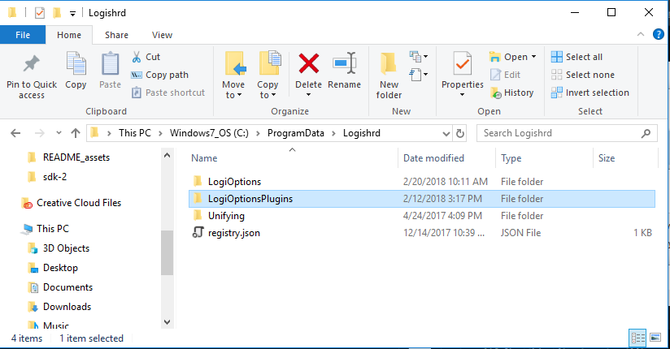
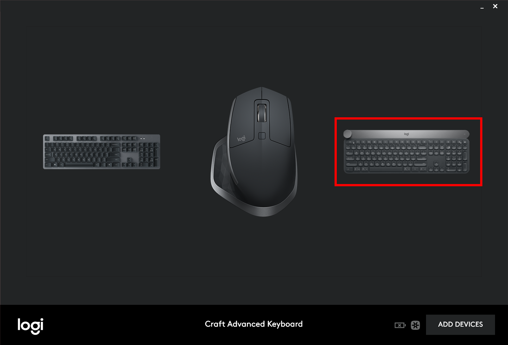
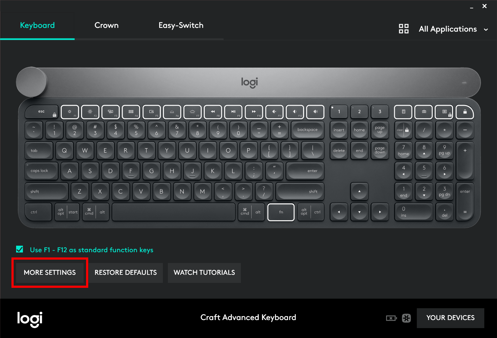
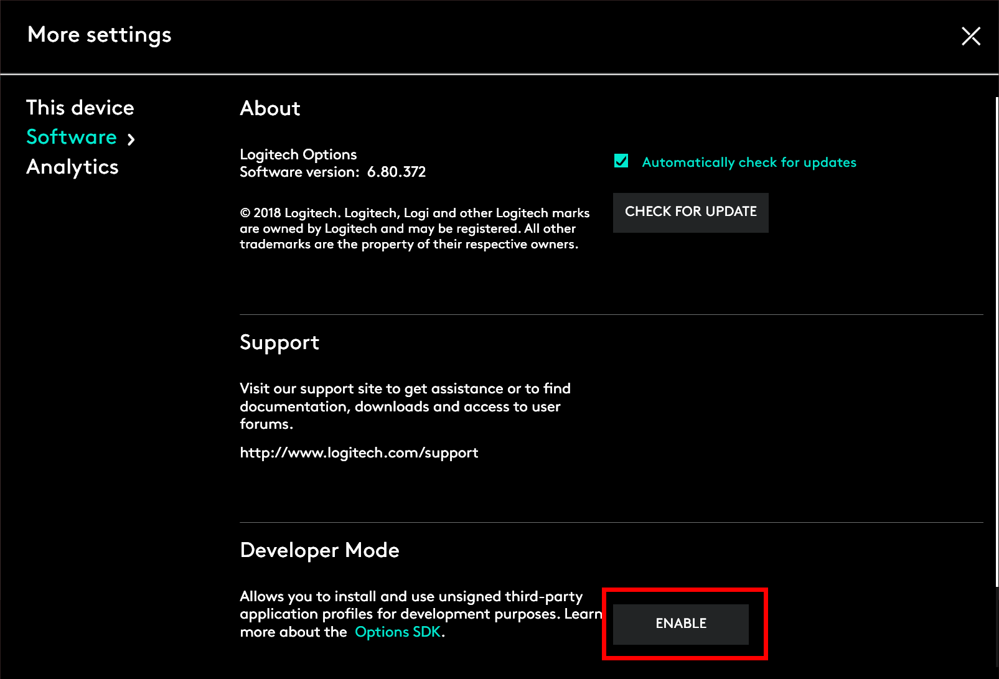

# Firefox Craft
Adds support for tab-dependent contextual use of crown in Firefox for Logitech Craft Keyboard

# Features
Added context support for Crown in Youtube player.

Tab switching for other web sites has been saved.

# Installation
## 1. What You'll Need (Requirements)

To get started on creating your own Craft plugin, you would need the following components connected and installed.

- **[Logitech Craft Advanced Keyboard](https://www.logitech.com/product/craft)**

 

- **[Logitech Options](http://support.logitech.com/software/options)**  
 Version 6.80 or above

 Currently Logitech Options supports the following platforms:

 Platform | Version
 :--- | :---
 Microsoft Windows|Windows 7 and above

- **Port availability**  
Communication between Logitech Options and plugins happens via port `10134`.
It is important to ensure there are no conflicts with this port and it is available for Logitech Options to use.

## 2. Copy `Firefox Craft` plugin to Logitech Options plugins folder
Go to Logitech Options plugins folder . `(C:\ProgramData\Logishrd)`.
Copy `LogiOptionsPlugins` folder (from this repository) into the `(C:\ProgramData\Logishrd)` folder.

## 3. Enable Developer Mode

Start **Logitech Options** and click **Craft Advanced Keyboard**.

Click `MORE SETTINGS`.

Click `ENABLE` button from the **Developer Mode** section.

## 4. Delete `Mozilla Firefox` from `All Applications`

## 5. Reload PC (Or kill all process of `Logitech Options` and start them)

## 6. Start `firefox_craft_proxy.exe`

## 7. Add `Firefox Craft` Application in `Logitech Options`

### Important! Uncheck `Mozilla Firefox` and check `Firefox Craft`!

## 8. Install `Firefox Craft` Firefox extension
Open Firefox.
Go to `about:addons`.
Click on `setting` button.

Choice `install from file`.
Select `firefox-extension.zip` (from this repository)

## 9. Done. Try to use Crown in any Youtube video.

# Compiling `firefox_craft_proxy.py`
1. Create virtual env: `python -m venv env`
2. Activate env: `./env/Scripts/activate`
3. Install `requirements.txt`: `pip install -r requirements.txt`
4. In `websocket-client` change `_handshake.py` (`.\env\Lib\site-packages\websocket\_handshake.py`) change `VERSION` to `VERSION=8`
5. build: `pyinstaller firefox_craft_proxy.py -y`

# Why we need to use `firefox_craft_proxy.py/exe`?
Because for Logitech Craft SDK we must send PID in `register` stage.